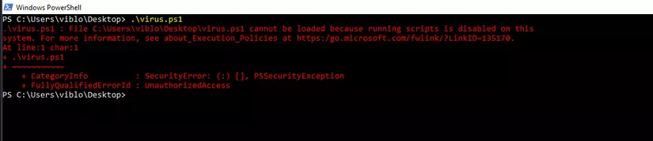

# PowerShell execution policies là gì?

## Lịch sử

Năm 2002, Snover của Microsoft nhận ra rằng Command Prompt (cmd.exe) không có khả năng viết script và tự động hóa các tác vụ tốt như shell của Linux (lẽ dĩ nhiên). Để thay đổi điều này, ông đã phát hành tài liệu mang tên Monad, phác thảo các kế hoạch về một công cụ thay thế - thứ sau này sẽ trở thành Powershell.

Từ năm 2006, Monad được đổi tên thành Powershell với số hiệu phiên bản 1.0. Kể từ đó, nó liên tục được bổ sung thêm các tính năng và chuyển thành một dự án Open source.

Powershell hiện tại hỗ trợ cả 3 nền tảng Mac - Linux - Windows.

## Sự khác nhau giữa Powershell và CMD

Để so sánh Powershell và CMD là một điều thực sự rất khó vì cơ bản chúng không giống nhau. Mỗi công cụ đều có những lợi ích riêng và cách sử dụng tùy theo từng trường hợp cụ thể. Tuy nhiên nhìn ở góc độ nào đó , Powershell như một bản nâng cấp ưu việt của CMD với nhiều tính năng và chức năng được bổ sung. Powershell có giao diện đồ họa tốt hơn, hỗ trợ các tác vụ tự động hóa tốt hơn, đa nền tảng hơn,được Microsoft chiều hơn (ưu tiên viết riêng một IDE Powershell ISE) , cung cấp khả năng debug tốt hơn.. Nói chung là "xịn" hơn.

## Tại sao Hacker lại “thích” Powershell ?

Đơn giản vì Powershell rất mạnh mẽ và cực kỳ thân thiện với Kernel, nó có thể giao tiếp thoải mái với Windows API , tự động hóa hoàn toàn các tác vụ quản trị trên máy tính,hỗ trợ các câu lệnh che dấu bản thân nó trước các phần mềm diệt Virus (trước khi AMSI xuất hiện). Kiểm soát được Powershell đồng nghĩa với việc kiểm soát được máy tính nạn nhân. Microsoft nhận thấy điều này từ rất sớm, qua đó họ phát triển nhiều tính năng nhằm hỗ trợ an toàn cho người sử dụng, một trong số đó là Powershell Execution Policy

## Vậy Powershell Execution Policies là gì ?

Powershell Execution Policies là một tính năng bảo mật được tích hợp sẵn trên Powershell nhằm ngăn chặn việc người dùng vô tình thực thi các tập lệnh độc hại. Tuy nhiên, không giống như Powershell Language Mode đóng vai trò như một Security Policies , Execution Policies rất dễ tính , nó cung cấp sẵn nhiều tùy chọn cho phép người dùng hay kẻ tấn công bỏ qua nó.

Để kiểm tra trạng thái Policies, ta sử dụng câu lệnh sau trên Powershell `Get-ExecutionPolicy`
Trạng thái trả về sẽ là: `Restricted`
Ở trạng thái mặc định này, khi chạy các tệp lệnh Powershell , hệ thống sẽ trả về thông báo lỗi như sau

## Cấu hình Powershell Execution Policies

Để cấu hình Powershell Execution Policies ta sử dụng câu lệnh sau
`Set-ExecutionPolicy -ExecutionPolicy [Policy Name]`
ví dụ như:`Set-ExecutionPolicy RemoteSigned` nhưng ngay cả khi gõ lệnh này, bạn cần truy cập powershell với quyền Administrator.

Nếu bạn đang ở powershell(không có quyền admin). Bạn cần mở quyền với lệnh sau:
`Set-ExecutionPolicy -Scope CurrentUser -ExecutionPolicy RemoteSigned`

Lệnh này sẽ cấu hình cho phép chạy các tệp lệnh được tải từ Internet và từ đó bạn có thể cài và sử dụng được các script từ các nguồn không tin cậy.
